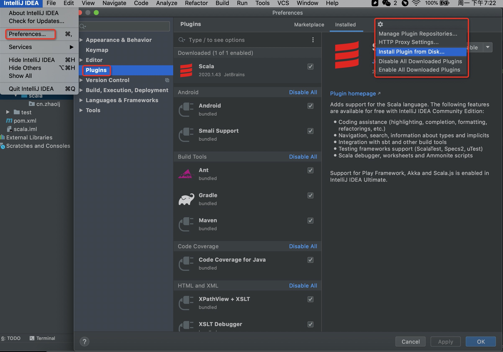
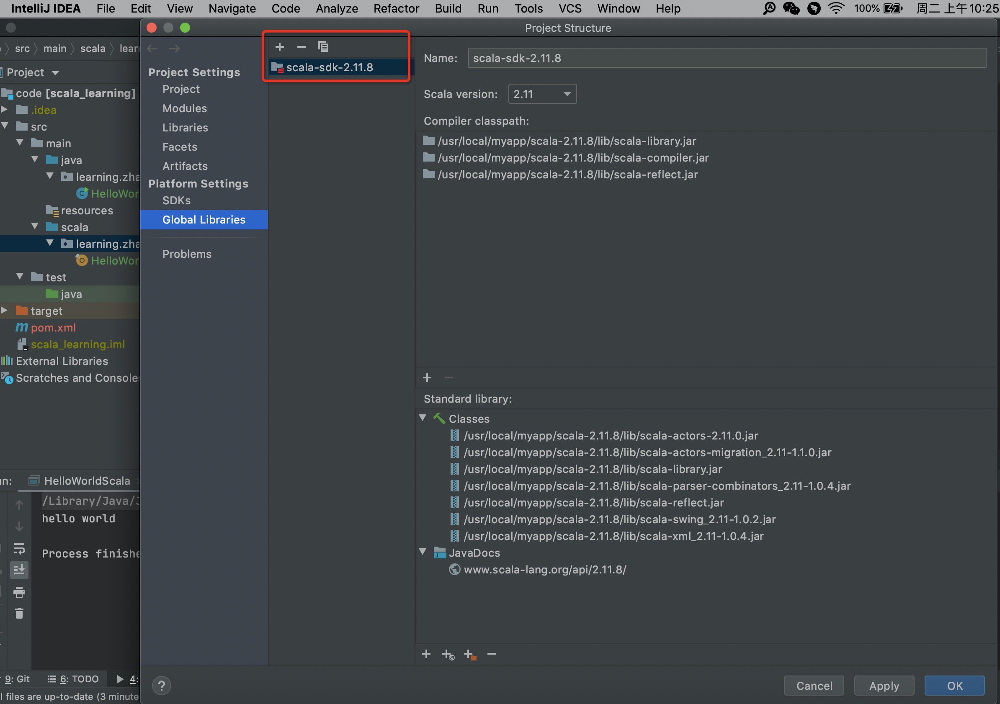
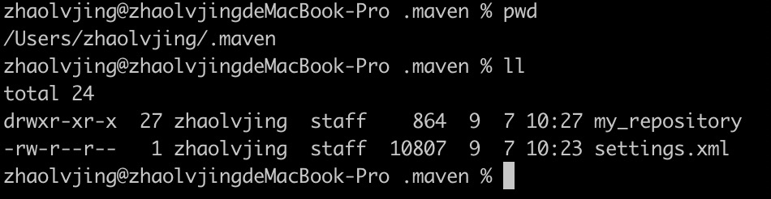
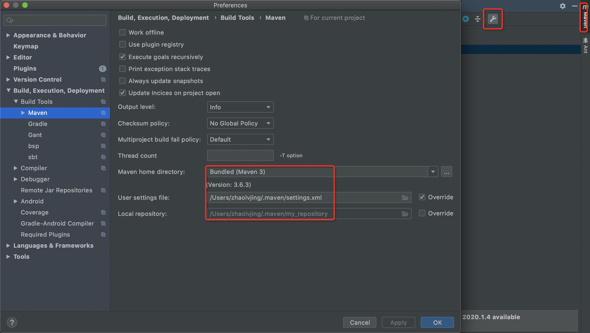
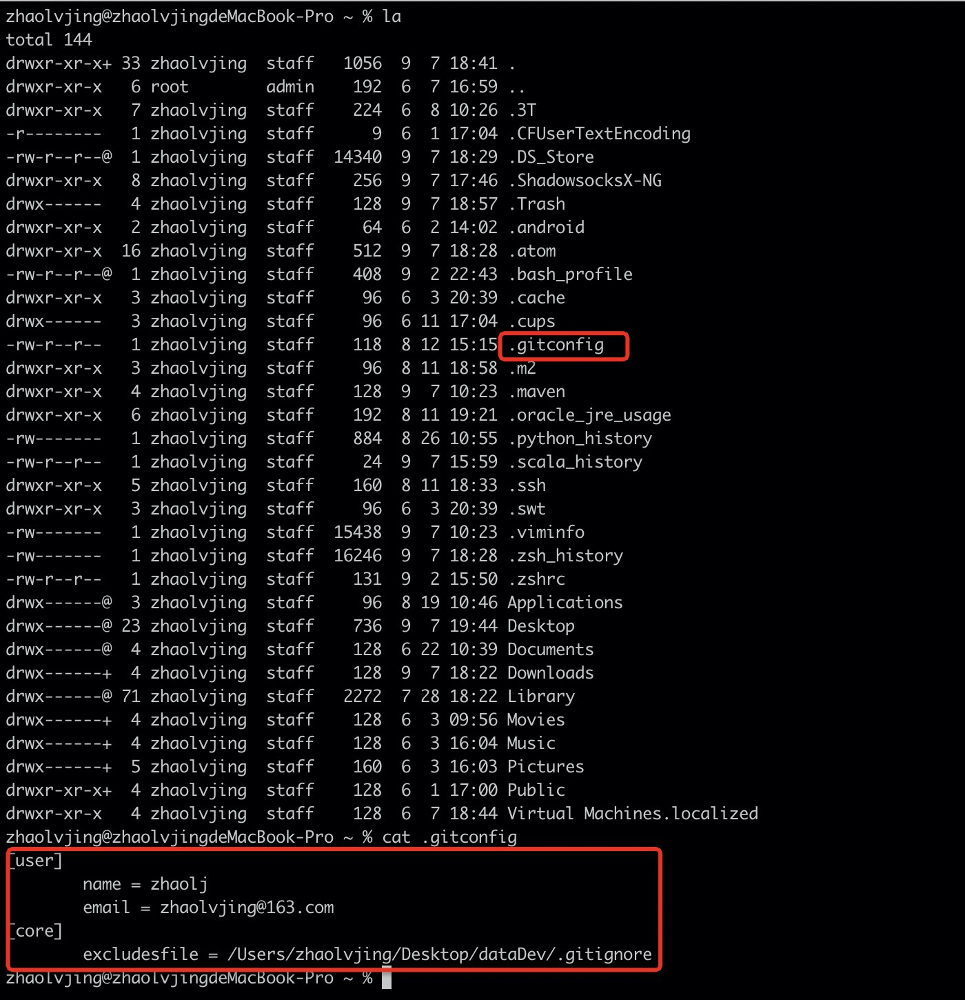
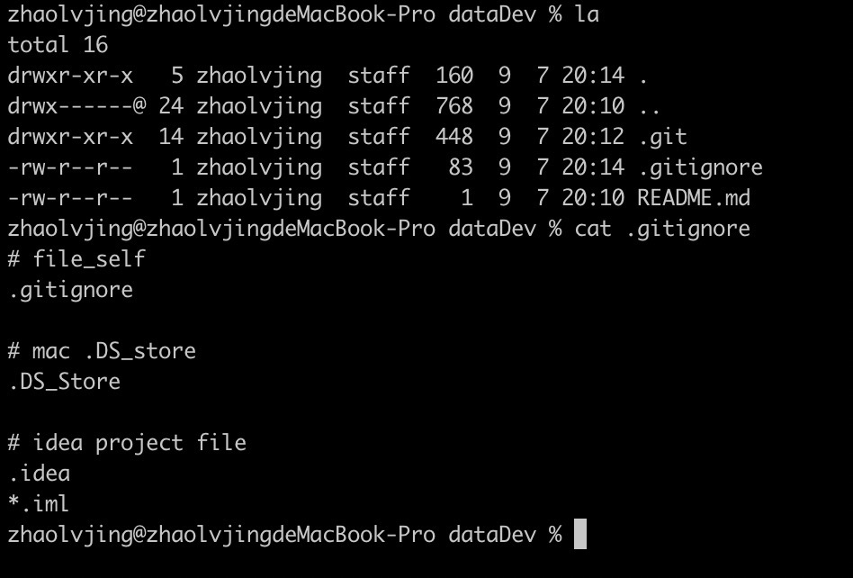

# Java
1、官方下载地址：<u>https://www.oracle.com/java/technologies/javase/javase8-archive-downloads.html</u>  
2、下载 8u51 及以上版本，如：jdk-8u51-macosx-x64.dmg  
3、下载完成后，双击安装    
4、安装完成后，配置环境变量：  
&nbsp;&nbsp;&nbsp;&nbsp;&nbsp;&nbsp;&nbsp;1）新建 .bash_profile 文件：`touch ~/.bash_profile`  
&nbsp;&nbsp;&nbsp;&nbsp;&nbsp;&nbsp;&nbsp;2）输入如下配置：  

``` shell  
# JAVA_HOME
JAVA_HOME="/Library/Java/JavaVirtualMachines/jdk1.8.0_211.jdk/Contents/Home"
PATH="$PATH:$JAVA_HOME/bin"

export JAVA_HOME PATH  
```
5、加载配置文件：`source ~/.bash_profile`  
6、测试是否安装成功：`java -version`（安装成功后，默认安装路径为：/Library/Java/JavaVirtualMachines）

**备注**：如果终端使用的是 zsh ，每次终端重新启动，上述配置不会自动生效。需要配置 .zshrc 文件，步骤如下：  
&nbsp;&nbsp;&nbsp;&nbsp;&nbsp;&nbsp;&nbsp;1）新建 .zshrc 文件：`touch ~/.zshrc `    
&nbsp;&nbsp;&nbsp;&nbsp;&nbsp;&nbsp;&nbsp;2）输入如下配置：

```shell
# 自动加载 .bash_profile 文件的配置信息
source ~/.bash_profile
```
**拓展**：自定义别名，并永久生效  
&nbsp;&nbsp;&nbsp;&nbsp;&nbsp;&nbsp;&nbsp;可在 .zshrc 文件中输入如下配置：


```shell
# user_defined_alias
alias ll='ls -l'
alias la='ls -la'
```

# Scala
1、官方下载地址：<u>https://www.scala-lang.org/download/2.11.8.html</u>  
2、下载 2.11.8 版本，如：scala-2.11.8.tgz  
3、解压安装（安装到 /usr/local/myapp 目录下）：

```shell
sudo tar -zxvf scala-2.11.8.tgz -C /usr/local/myapp
```
4、配置环境变量，在 .bash_profile 文件中新增如下配置：  

```shell
# SCALA_HOME
SCALA_HOME="/usr/local/myapp/scala-2.11.8"
PATH="$PATH:$SCALA_HOME/bin"

export SCALA_HOME PATH
```
5、加载配置文件：`source ~/.bash_profile`  
6、测试是否安装成功：`scala -version`  
**idea 环境配置：**  
&nbsp;&nbsp;&nbsp;&nbsp;&nbsp;&nbsp;&nbsp;方式一：idea 官网下载 idea 对应版本的 scala 插件，然后离线安装。官网地址：<u>https://plugins.jetbrains.com/plugin/1347-scala</u>  

&nbsp;&nbsp;&nbsp;&nbsp;&nbsp;&nbsp;&nbsp;方式二：idea 软件内搜索安装  
&nbsp;&nbsp;&nbsp;&nbsp;&nbsp;&nbsp;&nbsp;任选一方式完成上述配置后，在项目结构里添加 scala 的lib 包，即可创建 scala class  

**小提示：**在项目中添加 scala 的 lib 时，选择上面手动安装的 scala-2.11.8 版本。由于 scala 的安装目录在 /usr/local 下，该目录对于 Finder 是隐藏的，所以在添加 lib 包时，Browser 打开 Finder  后，需使用 command+shift+G ，在弹出的搜索框中输入要查找的目录路径即可找到对应的文件

# Maven
1、官方下载地址：<u>http://maven.apache.org/download.cgi</u>  
2、下载 3.2.5 版本（flink 推荐）。此处下载的版本为 3.6.3：apache-maven-3.6.3-bin.tar.gz  
3、解压安装（安装到 /usr/local/myapp 目录下）：

```shell
sudo tar -zxvf apache-maven-3.6.3-bin.tar.gz -C /usr/local/myapp
```
4、配置环境变量，在 .bash_profile 文件中新增如下配置：  

```shell
# MAVEN_HOME
MAVEN_HOME="/usr/local/myapp/maven-3.6.3"
PATH="$PATH:$MAVEN_HOME/bin"

export MAVEN_HOME PATH
```
5、加载配置文件：`source ~/.bash_profile`  
6、测试是否安装成功：`mvn -v`  
**其他配置（修改 conf/settings.xml）**：  
&nbsp;&nbsp;&nbsp;&nbsp;&nbsp;&nbsp;&nbsp;1）自定义本地仓库地址；  
&nbsp;&nbsp;&nbsp;&nbsp;&nbsp;&nbsp;&nbsp;2）添加阿里云中央仓库；  
配置详情如下：  

```xml
<!-- 本地仓库地址 -->
<localRepository>/Users/zhaolvjing/.maven/my_repository</localRepository>

<!-- 阿里云中央仓库 -->
<mirror>
    <id>aliyun</id>
    <mirrorOf>central</mirrorOf>
    <name>aliyun maven</name>
    <url>http://maven.aliyun.com/nexus/content/groups/public</url>
</mirror>
```
**踩坑经验**：自定义的配置文件 settings.xml 需放置在用户目录下，不然会出现访问不到配置文件的问题。  
*Could not transfer artifact org.apache.maven.plugins:maven-clean-plugin:pom:2.5 from/to aliyun (http://maven.aliyun.com/nexus/content/groups/public): /usr/local/myapp/maven-3.6.3/my_repository/org/apache/maven/plugins/maven-clean-plugin/2.5/maven-clean-plugin-2.5.pom.part.lock (No such file or directory)*  
  


# Git
1、官方下载地址：<u>https://sourceforge.net/projects/git-osx-installer/</u>  
2、下载完成后，直接双击 git-2.23.0-intel-universal-mavericks.dmg 完成安装  
3、测试是否安装成功：`git --version`   
4、安装成功后，便可使用 git 命令完成其他操作  
**说明：**  
1、使用 git config --global 完成一些全局的配置，比如：用户名、邮箱、过滤文件等设置。在用户目录下会有一个隐藏文件 .gitconfig 来保存这些配置项，如图所示：  

2、过滤文件设置。以我的一个 git 项目为例，在该项目文件夹下，新建一个 .gitignore 文件，配置要忽略的文件，如图所示：


# Zeppelin
1、官网下载地址：<u>http://zeppelin.apache.org/download.html</u>  
2、解压安装（安装到 /usr/local/myapp 目录下）：

```shell
sudo tar -zxvf zeppelin-0.9.0-preview2-bin-all.tgz -C /usr/local/myapp
```
3、配置环境变量，在 .bash_profile 文件中新增如下配置：  

```shell
# ZEPPELIN_HOME
ZEPPELIN_HOME="/usr/local/myapp/zeppelin-0.9.0"
PATH="$PATH:$ZEPPELIN_HOME/bin"

export ZEPPELIN_HOME PATH
```
4、加载配置文件：`source ~/.bash_profile`  
